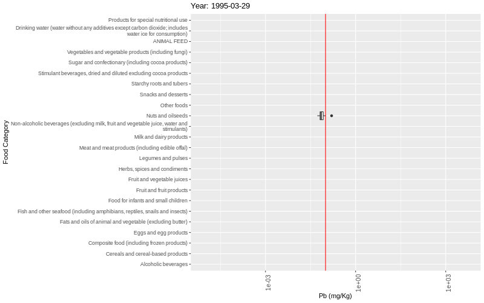

## Portfolio

---

### Completed projects

[Did you got your daily dose of Lead today?](https://htmlpreview.github.io/?https://raw.githubusercontent.com/fabianofrombrazil/GEMS/main/GEMS_notebook.html) 
Using the GEMS/WHO database to find the most lead contaminated food and if Analitical Quality tools are useful

---
[Is it possible to travel around the world with US$0.06/km](/pdf/Flights.pdf) 
Finding the lowest possible airfare and the strange precing strategies from air company

---
[Where all my checks useful during these 10 years??](https://htmlpreview.github.io/?https://raw.githubusercontent.com/fabianofrombrazil/Calibration/main/calib2.html) 
A study on intermediate checks on laboratory instruments during a 10 year period under ISO 17025 

---

